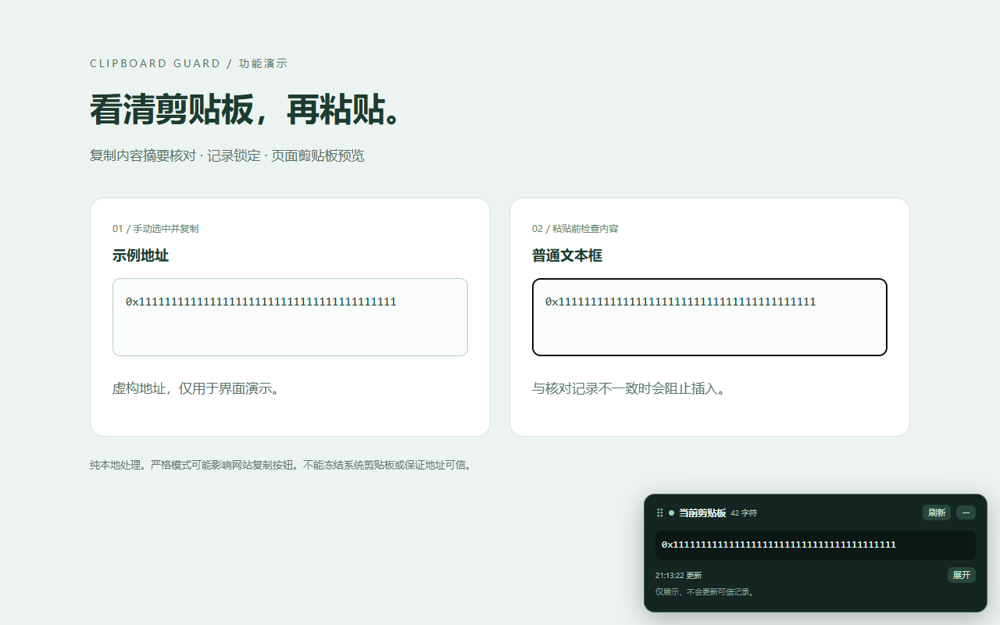

# 剪贴板守卫 · Clipboard Guard

在普通网页中预览剪贴板、核对复制与粘贴内容，并拦截常见网页脚本写入。当前版本：**1.2.0**。

[下载最新版安装包](https://github.com/timethrough/clipboard-guard/releases/latest) · [隐私政策](docs/privacy-policy.md) · [反馈问题](https://github.com/timethrough/clipboard-guard/issues)

## 功能

- 手动选中文本复制后记录摘要，粘贴前核对；内容不一致时阻止插入并提醒。
- 锁定核对记录，防止后续复制覆盖基准。
- 页面悬浮条展示剪贴板，前台聚焦时每秒尝试更新，支持展开和收起暂停。
- 按住标题拖动悬浮条；收起后也能拖动。双击标题回到右下角，刷新网页后位置复位。
- 原文不上传、不保留复制历史；界面只在设备本地处理。

## 安装

目前提供本地安装包；Chrome 网上应用店版本尚未发布。

1. 在 Releases 页面下载 `clipboard-guard-v1.2.0.zip`，解压到固定位置。
2. Chrome 地址栏打开 `chrome://extensions`，开启「开发者模式」。
3. 点击「加载已解压的扩展程序」，选择**直接包含 manifest.json 的文件夹**。
4. 刷新普通网页，即可看到悬浮条。可在扩展菜单中固定图标。

更新时覆盖原文件夹，在扩展管理页点击「重新加载」，然后刷新网页。

## 使用与兼容性

手动选中文本 → Ctrl+C → 可选锁定记录 → 在普通文本框 Ctrl+V。

严格模式会阻止常见的网页复制 API，网站自带复制按钮可能失效，请使用手动选中复制。来自其他软件的文本不会自动建立可信记录；需在扩展弹窗中与可信原文核对后，点击「确认可信并复制」。

仅支持纯文本，最多核对 262,144 个 JavaScript 字符单元；预览最多显示前 4096 个字符。按完整文本匹配，不忽略空白、换行或大小写。支持普通文本框和部分 contenteditable，复杂编辑器、图片和富文本可能不兼容。

仅覆盖获准运行扩展的 HTTP/HTTPS 网页及匹配子框架。Chrome 内部页、商店页、PDF、地址栏、其他扩展及原生软件不在保护范围。

## 数据与安全边界

悬浮条默认在前台聚焦页面中每秒尝试读取系统剪贴板，包括可能来自其他软件的文本。收起后暂停，页面失焦时不读取新文本；显示内容可能出现在截图中。

仅在浏览器会话存储保存最近一条 SHA-256 摘要、字符数、时间、来源 origin、锁定状态与不一致次数；原文只在校验、弹窗和独立预览框架中暂留内存。没有服务器、遥测、广告或远程代码。详情见[隐私政策](docs/privacy-policy.md)。

**不能冻结系统剪贴板、识别修改程序、清除木马或保证地址可信。** MAIN 世界脚本拦截为尽力防护，网页或其他扩展可能绕过；网站也可能在粘贴后修改输入值。每秒预览不能捕捉所有瞬时变化，请在提交前核对最终内容。

## 源码

Manifest V3，无构建依赖。根目录是扩展源码，可直接加载。`docs` 为使用说明与截图，不是运行所必需。仅上传运行文件即可生成商店提交包。
